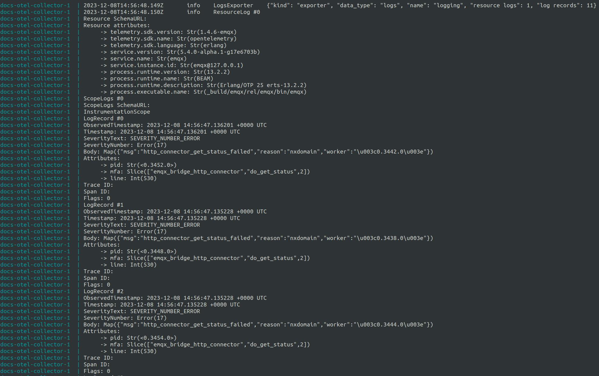

# EMQX OpenTelemetry Logs

EMQX 5.4 introduced a special log handler that allows to format log events according to (Open Telemetry log data model](https://opentelemetry.io/docs/specs/otel/logs/data-model/) and export them to the configured Open Telemetry collector or backend.

## Prerequisites

Before enabling EMQX  OpenTelemetry logs, you need to deploy and configure OpenTelemetry Collector and some OpenTelemetry compatible logging collection system. In this example, we will deploy OpenTelemetry Collector and configure it to output the logs to `stdout` using debug exporter:

 - [OpenTelemetry Collector](https://opentelemetry.io/docs/collector/getting-started).

## Local setup

1. Create OpenTelemetry Collector config file, `otel-logs-collector-config.yaml`:

```yaml
receivers:
  otlp:
    protocols:
      grpc:

exporters:
  logging:
    verbosity: detailed

processors:
  batch:

extensions:
  health_check:

service:
  extensions: [health_check]
  pipelines:
    logs:
      receivers: [otlp]
      processors: [batch]
      exporters: [logging]
```

2. Create `docker-compose-otel-logs.yaml` in the same directory as the otel config file:

```yaml
version: '3.9'

services:

  # Collector
  otel-collector:
    image: otel/opentelemetry-collector:0.90.0
    restart: always
    command: ["--config=/etc/otel-collector-config.yaml", "${OTELCOL_ARGS}"]
    volumes:
      - ./otel-logs-collector-config.yaml:/etc/otel-collector-config.yaml
    ports:
      - "13133:13133" # health_check extension
      - "4317:4317"   # OTLP gRPC receiver
```

3. Start the collector:

```bash
docker compose -f docker-compose-otel-logs.yaml up
```

4. Once the docker compose service is up, OpenTelemetry collector must be accessible on the host machine at http://localhost:4317.


## Configure EMQX OpenTelemetry logs integration

1. Add the following configuration to EMQX cluster.hocon (assuming that EMQX is running on the same local machine):

```
opentelemetry {
  exporter {endpoint = "http://localhost:4317"}
  logs {enable = true, level = warning}
}
```
::: tip Warning

`opentelemetry.logs.level` is superseded by the log level of the default [EMQX log handler(s)](../log.md).
For example, if OpenTelemetry logs level is `info` but EMQX console log level is `error`, only log events that have `error` or higher level will be exported to the configured OpenTelemetry receiver.
:::

2. Start EMQX node.

3. Trigger some EMQX log events, for example by creating a bridge to a not accessible HTTP service using Dashboard:

   

4. After a short period of time (around 1s by default), Otel Collector is expected to print received EMQX log events about HTTP bridge connection failure:

   


## Overload protection

EMQX accumulates log events and exports them periodically in batches.
The exporting interval is controlled by `opentelemetry.logs.scheduled_delay` configuration parameter, which defaults to 1s.
The batching logs handler has an overload protection mechanism, which allows to accumulate log events only up to a certain limit.

This limit is configurable and defaults to 2048 spans:

```
opentelemetry {
  logs {max_queue_size = 2048}
}
```
Once the `max_queue_size` limit is reached, new log events will be dropped until the current queue is exported.

::: tip Warning

OpenTelemetry logs overload protection works independently from the default [EMQX log handler(s)](../log.md) OLP.
Thus, depending on the configuration, the same log event can be dropped by OpenTelemetry handler but logged by default EMQX log handler(s) or vice versa.
:::
