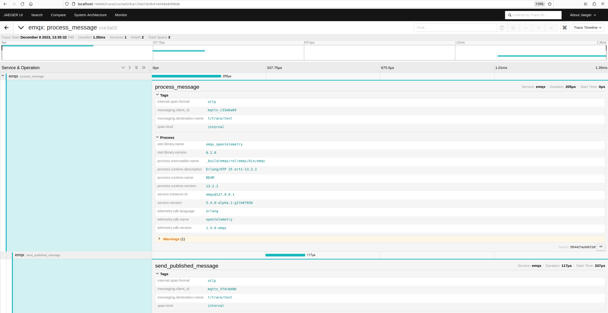

# 集成 OpenTelemetry 追踪

"Trace context"（追踪上下文）是一种分布式追踪的机制，它用于跟踪和识别跨越多个系统和服务的请求或事务。在 [W3C 的 Trace Context MQTT](https://w3c.github.io/trace-context-mqtt/) 文档中，这一概念被应用于 MQTT 协议，以实现跨越 MQTT 消息传输中的不同参与者的请求追踪。这样，系统管理员或开发人员可以通过追踪信息来理解消息在整个系统中的流转情况。EMQX 传播追踪上下文的固有能力使其能够无缝地参与分布式追踪系统，这种传播是通过简单地将消息发布者的 `traceparent` 和 `tracestate` 用户属性转发给订阅者来实现的。当 EMQX 将应用消息转发给客户端时，它保证了追踪上下文完整不变地传输。这种方法完全符合 [MQTT 规范 3.3.2.3.7](https://docs.oasis-open.org/mqtt/mqtt/v5.0/os/mqtt-v5.0-os.html#_Toc3901116)，确保了追踪数据传输的一致性和可靠性。

::: warning 注意

用户属性在 MQTT 5.0 中被引入，因此 EMQX 只有在使用 MQTT 5.0 时才能提取和传播追踪上下文。 

:::

EMQX 支持与分布式 [OpenTelemetry 追踪](https://opentelemetry.io/docs/concepts/signals/traces/)的集成，通过 MQTT 用户属性传播追踪上下文，有利于追踪 EMQX 特定的操作和追踪跨度。这种额外级别的追踪集成增强了对 EMQX 内部运作的可见性，补充了标准追踪上下文传播机制，从而增强了监控和调试能力。

本页介绍了如何将 OpenTelemetry 追踪与 EMQX 集成，详细描述了设置 OpenTelemetry Collector 并在 EMQX 中启用和配置 OpenTelemetry 追踪集成，以及管理追踪跨度过载。

## 设置 OpenTelemetry Collector

在将 EMQX 与 OpenTelemetry 追踪集成之前，您需要部署并配置 [OpenTelemetry Collector](https://opentelemetry.io/docs/collector/getting-started) 以及一个兼容 OpenTelemetry 的可观测性平台，例如 [Jaeger](https://www.jaegertracing.io/docs/latest/deployment/)。以下步骤概述了部署和配置过程：

1. 创建 OpenTelemetry Collector 配置文件 `otel-trace-collector-config.yaml`：

   ```yaml
   receivers:
     otlp:
       protocols:
         grpc:
   
   exporters:
     otlp:
       endpoint: jaeger:4317
       tls:
         insecure: true
   
   processors:
     batch:
   
   extensions:
     health_check:
   
   service:
     extensions: [health_check]
     pipelines:
       traces:
         receivers: [otlp]
         processors: [batch]
         exporters: [otlp]
   ```

2. 在相同目录下创建 Docker Compose 文件 `docker-compose-otel-trace.yaml`：

   ```yaml
   version: '3.9'
   services:
     jaeger:
       image: jaegertracing/all-in-one:1.51.0
       restart: always
       ports:
         - "16686:16686"
   
     otel-collector:
       image: otel/opentelemetry-collector:0.90.0
       restart: always
       command: ["--config=/etc/otel-collector-config.yaml", "${OTELCOL_ARGS}"]
       volumes:
         - ./otel-trace-collector-config.yaml:/etc/otel-collector-config.yaml
       ports:
         - "13133:13133" # 健康检查扩展
         - "4317:4317"   # OTLP gRPC 接收器
       depends_on:
         - jaeger
   ```

3. 使用 Docker Compose 启动服务：

   ```bash
   docker compose -f docker-compose-otel-trace.yaml up
   ```

4. 启动后，OpenTelemetry Collector 将在主机的默认 GRPC 端口（4317）上监听，Jaeger WEB UI 可以在 [http://localhost:16686](http://localhost:16686/) 访问。

## 在 EMQX 中启用 OpenTelemetry 追踪

本节指导您如何在 EMQX 中启用 OpenTelemetry 追踪，展示多节点设置中的分布式追踪能力。

1. 将以下配置添加到 EMQX `cluster.hocon` 文件中（假设 EMQX 在本地机器上运行）：

   ```bash
   opentelemetry {
     exporter {endpoint = "http://localhost:4317"}
     traces {enable = true}
   }
   ```

2. 启动 EMQX 节点，例如，以节点名 `emqx@127.0.0.1` 和 `emqx1@127.0.0.1` 启动一个有两个节点的集群，以展示分布式追踪功能。

3. 使用 [MQTTX CLI](https://mqttx.app/zh/cli) 作为客户端在不同节点和端口上订阅相同主题。

   - 在 `emqx@127.0.0.1` 节点上（默认 MQTT 监听器在端口 1883）：

     ```bash
     mqttx-cli sub -t t/trace/test -h localhost -p 1883
     ```

   - 在 `emqx1@127.0.0.1` 节点上（监听器在端口 1884）：

     ```bash
     mqttx-cli sub -t t/trace/test -h localhost -p 1884
     ```

4. 发布带有追踪上下文的消息，向主题发送包含有效 `traceparent` 用户属性的消息：

   ```bash
   mqttx-cli pub -t t/trace/test -h localhost -p 1883 -up "traceparent: 00-cce3a024ca134a7cb4b41e048e8d98de-cef47eaa4ebc3fae-01"
   ```

5. 大约 5 秒后（EMQX 导出追踪数据的默认间隔），导航到 [http://localhost:16686](http://localhost:16686/) 的 Jaeger WEB UI 观察追踪数据：

   - 选择 `emqx` 服务并点击 **查找追踪**。如果 `emqx` 服务没有立即出现，请稍等片刻后刷新页面。您应该看到消息追踪：

     

   - 点击追踪查看详细的跨度信息和追踪时间线：

     

在此示例中，EMQX 追踪了两种不同类型的跨度：

- `process_message` 跨度从接收并解析 PUBLISH 包的 EMQX 节点开始，直到消息被分发给本地订阅者和/或转发给其他有活跃订阅者的节点为止。每个跨度对应一个被追踪的已发布消息。
- `send_published_message` 跨度从被订阅者的连接控制进程接收追踪消息开始，直到将外发包序列化并发送到连接套接字为止。每个活跃订阅者都会创建一个 `send_published_message` 跨度。

## 管理追踪跨度过载

EMQX 会积累追踪跨度，并定期批量导出它们。 导出间隔由 `opentelemetry.trace.scheduled_delay` 参数控制，默认为 5 秒。 批处理追踪跨度处理器包含过载保护机制，允许只积累到一定限制的跨度，该限制默认为 2048 个跨度。您可以使用以下配置设置此限制：

```yaml
opentelemetry {
  traces {max_queue_size = 2048}
}
```

一旦达到 `max_queue_size` 限制，新的追踪跨度将被丢弃，直到当前队列被导出。

::: warning 注意

如果追踪的消息被分发给大量订阅者（远高于 `max_queue_size` 的值）， 预计只有少量跨度会被导出，大多数跨度会因过载保护而被丢弃。

增加 `max_queue_size` 应该非常谨慎，因为它可能会影响性能和内存消耗。 :::
